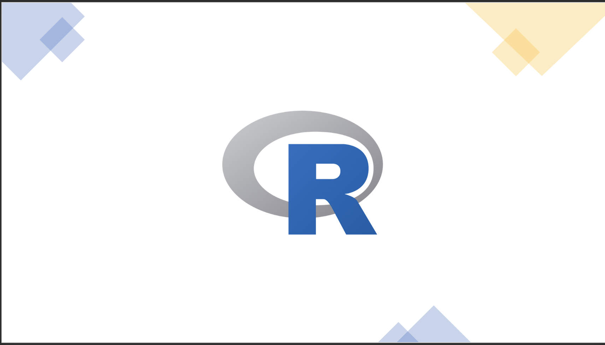

QuACK is a grad student initiative to teach foundational programming and data skills to grad students, RAs and Post-bacs in the psychology department
Learn more about QuACK [here](https://wvoorhies.github.io/sample_webpage/about/about)

# R courses

### Summer R bootcamp
Learn more about our 4 session summer bootcamp
### QuACK 2020 materials
Find materials from our most recent semester long [introductory programming workshop](https://wvoorhies.github.io/sample_webpage/QuACK2020/QuACK_2020)

### Past QuACK materials

**interested in learning more?** Take our class next fall!
