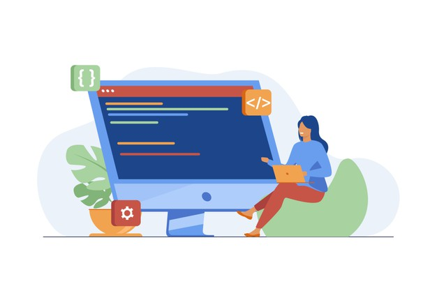

# Welcome to QuACK!
QuACK is a UC Berkeley Psychology grad student initiative. We teach foundational programming and data skills to grad students, RAs, and Post-bacs in the community.

#### [Learn more about us](https://ucb-psychology-quack.github.io/site/about/about)

## Learn R
Find materials for our R courses below
### [QuACK 2021 workshop](https://github.com/UCB-Psychology-QuACK/site/blob/main/QuACK2021/Quack2021.md)
QuACK is back! Find the schedule and materials for our most recent semester-long programming workshop!
### [Programming and Data Skills summer bootcamp](https://ucb-psychology-quack.github.io/site/summer_bootcamp/bootcamp)
Learn more about our upcoming 4 session summer bootcamp for RAs, post-bacs and grads
### [QuACK 2020 workshop](https://ucb-psychology-quack.github.io/site/QuACK2020/QuACK_2020)
Find materials from last year's introductory 13-week programming workshop. 
 
 
 
**Interested in learning more?** Try some of these [other amazing R resources!](https://ucb-psychology-quack.github.io/site/resources/r-resources) 
