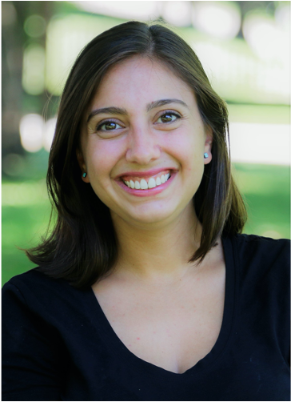

# About QuACK
QuAck was started as a workshop in 2016 by Berkeley Psychology graduate students for graduate stuents who wanted to learn more about quantiative analysis and coding in R. Originally started as a semester long workshop for first year grads, QuACK has expanded to a student led grad class for introductory programming. We are hoping to continue to expand QuACK and provide more opportunities for learning throughout the community. 

# Our goals 
Goal 1: Teach foundational programming and data skills to members of the community.

Goal 2: Build an inclusive, supportive, and positive space for learning quantitative and coding skills.

Goal 3: Create open access learning materials 

# About Us
 [Elena Leib](https://bungelab.berkeley.edu/graduate-students/)(Ph.d Candidate, Psychology)

 [Willa Voorhies](https://cnl.berkeley.edu/people/willa-voorhies/)(Ph.dCandidate, Psychology)

[contact us]()
