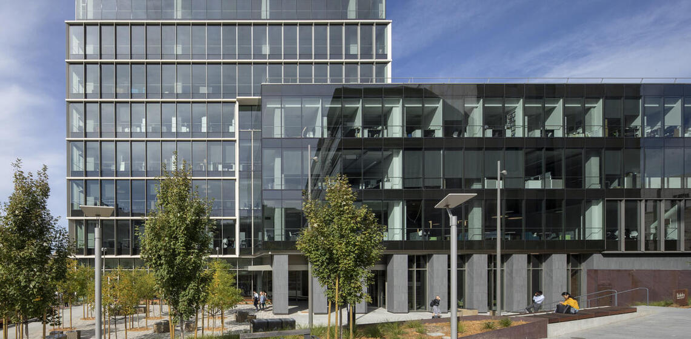

# About QuACK
QuAck was started as a workshop in 2016 by Berkeley Psychology graduate students for graduate stuents who wanted to learn more about quantiative analysis and coding in R. Originally started as a semester long workshop for first year grads, QuACK has expanded to a student led grad class. We are hoping to continue to expand QuACK and provide more opportunities for learning throughout the community. 

# Our goals 
We want to provide a welcome and inclusive environment where anyone can learn to program. 

# About Us
QuACK's current coorinators and instructors are Elena Leib (Ph.D candidate, Psychology) and Willa Voorhies (Ph.D candidate, Psychology)

  * [Elena Leib](https://bungelab.berkeley.edu/graduate-students/)    
  * [Willa Voorhies](https://cnl.berkeley.edu/people/willa-voorhies/)
